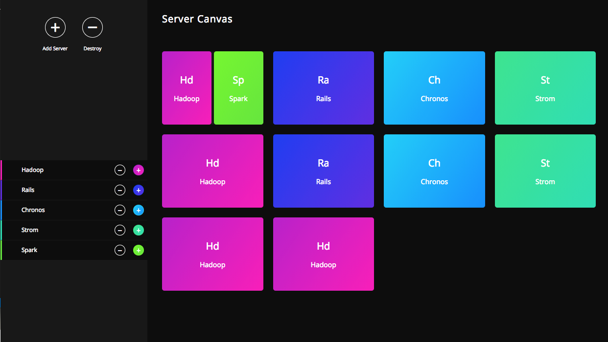

## Prerequisites

- Make sure you have `node` installed

## Setup

- Download the project and cd into project directory
- In the project directory, run `npm install` to get all the dependencies.
- In order to run the App, run `npm start`
- The app should start in the development mode. Open [http://localhost:3000](http://localhost:3000) to view it in the browser. The page will reload if you make edits.

